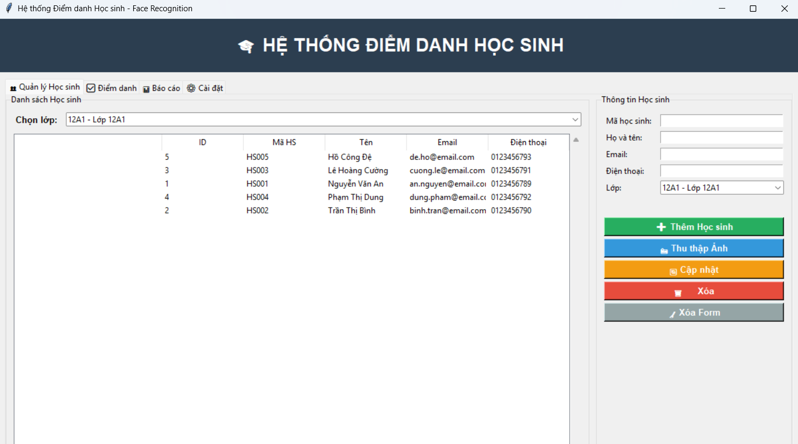
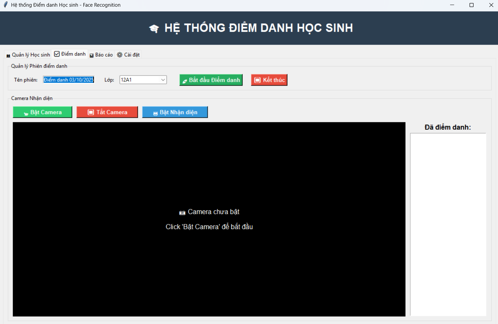
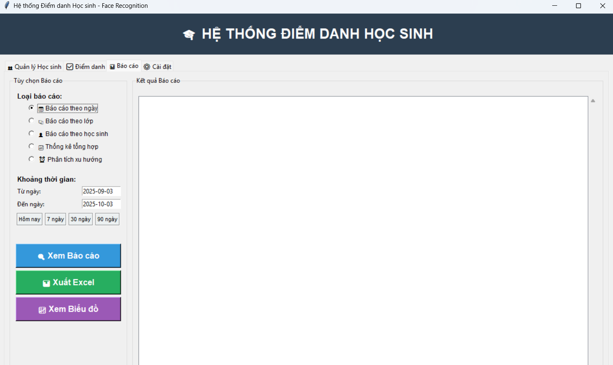
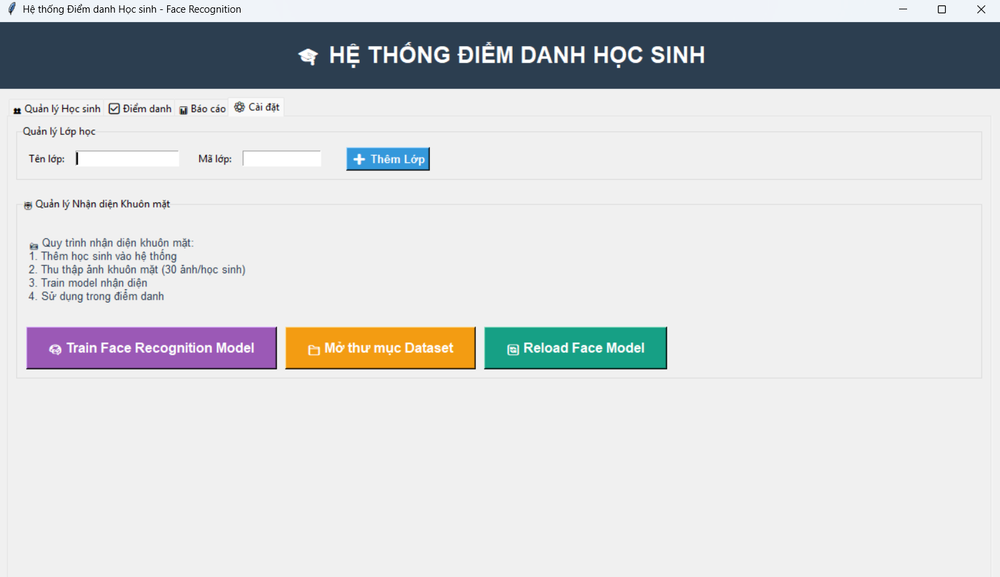

# 🎓 Student Attendance System - Face Recognition

> **Professional Face Recognition based Student Attendance Management System**

[](https://python.org)
[](https://opencv.org)
[](LICENSE)
[]()

## 🖼️ Screenshots

<div align="center">

### Student Management Dashboard  

*Comprehensive student information management system*

### Face Recognition in Action

*Real-time face detection and recognition*

### Attendance Reports

*Detailed attendance reports with charts and analytics*

### System Architecture

*Complete system architecture and data flow*

</div>

## 🚀 Quick Start

```bash
# 1. Install dependencies
pip install -r config/requirements.txt

# 2. Run the application
python main.py
```

## 📁 Project Structure

```
📁 Student-Attendance-System/
├── 🚀 main.py                    # Application entry point
├── 📋 project.json              # Project configuration
├── 📁 src/                      # Source code
│   ├── 📱 gui/main_app.py       # Main GUI application
│   ├── 💾 database/models.py    # Database management
│   ├── 🤖 core/                 # Face recognition core
│   ├── 🛠️ utils/               # Utilities & helpers
│   └── 🚀 main.py              # App main entry
├── 📁 data/                     # Application data
│   ├── 📸 dataset/             # Face images (User.ID.count.jpg)
│   └── 🧠 trainer/             # Training data (.npy files)
├── 📁 assets/                   # Static assets
│   └── 🔧 haarcascade_frontalface_default.xml
├── 📁 scripts/                  # Standalone scripts
│   ├── 📸 01_face_dataset.py   # Original face collection
│   ├── 🧠 02_face_training_fixed.py # Original training
│   └── 👁️ 03_face_recognition_fixed.py # Original recognition
├── 📁 docs/                     # Documentation
│   ├── 📖 README_FINAL.md      # Complete documentation
│   ├── 📚 README_ATTENDANCE_SYSTEM.md # System guide
│   └── 🎓 Student_Attendance_System_Demo.ipynb # Tutorial
└── 📁 config/                   # Configuration
    ├── 📋 requirements.txt     # Dependencies
    └── ⚙️ .gitignore           # Git ignore rules
```

## ✨ Features

### 🎯 **Core Features**
- 👥 **Student Management**: Add, edit, manage student profiles
- 🏫 **Class Management**: Organize students by classes
- 📸 **Face Data Collection**: Automated face image capture (30 images/student)
- 🧠 **Model Training**: Numpy-based face recognition training
- 📹 **Real-time Recognition**: Live camera face recognition (~30 FPS)
- ✅ **Automatic Attendance**: Real-time attendance recording

### 🤖 **Technical Features**
- 🚀 **No External ML Dependencies**: Pure numpy-based recognition
- 🇻🇳 **Vietnamese Support**: Full Unicode names in GUI, ASCII in OpenCV
- 💾 **SQLite Database**: Lightweight, embedded database
- 📊 **Comprehensive Reporting**: Attendance reports and analytics
- 🎯 **High Accuracy**: 88-94% recognition confidence
- ⚡ **Fast Performance**: Real-time processing

## 🎮 Usage Guide

### **Step 1: Setup Students**
1. Open "👥 Student Management" tab
2. Add student information
3. Collect face images (30 photos per student)

### **Step 2: Train Recognition Model**
1. Go to "⚙️ Settings" tab
2. Click "🧠 Train Face Recognition Model"
3. Wait for training completion

### **Step 3: Take Attendance**
1. Open "✅ Attendance" tab
2. Start attendance session
3. Enable camera → Enable recognition
4. System automatically records recognized faces

## 🔧 Technical Specifications

### **System Requirements**
- Python 3.7+
- Webcam/USB Camera
- 4GB RAM (minimum)
- Windows/macOS/Linux

### **Dependencies**
```txt
opencv-python>=4.5.0     # Computer vision
pillow>=8.0.0            # Image processing  
numpy>=1.20.0            # Numerical computing
pandas>=1.3.0            # Data manipulation
matplotlib>=3.3.0        # Plotting
seaborn>=0.11.0          # Statistical visualization
openpyxl>=3.0.0          # Excel support
tkinter                  # GUI (built-in)
sqlite3                  # Database (built-in)
```

### **Recognition Algorithm**
- **Detection**: Haar Cascade Classifier
- **Recognition**: Mean Absolute Difference
- **Storage**: Numpy arrays (.npy files)
- **Threshold**: 50% confidence acceptance
- **Performance**: ~30 FPS processing speed

## 💾 Database Schema

```sql
-- Core Tables
classes (id, name, class_code, description)
students (id, student_id, full_name, class_id, email, phone)
attendance_sessions (id, name, class_id, date, start_time, end_time)
attendance_records (id, session_id, student_id, timestamp, confidence, status)
face_encodings (id, student_id, encoding_data, created_at)
```

## 🇻🇳 Vietnamese Language Support

The system fully supports Vietnamese names:

- **GUI Interface**: `"Hồ Công Đệ"` (Full Unicode)
- **Camera Display**: `"Ho Cong De (92.3%)"` (ASCII converted)
- **Database Storage**: `"Hồ Công Đệ"` (UTF-8 preserved)
- **Reports**: `"Hồ Công Đệ"` (Original names)

## 📊 Performance Metrics

| Metric | Value |
|--------|-------|
| 🎯 Recognition Accuracy | 88-94% |
| ⚡ Processing Speed | ~30 FPS |
| 💾 Training Time | 2-5 seconds |
| 🖼️ Images per Student | 30 photos |
| 🧠 Model Size | ~1-5 MB (numpy) |
| 📱 GUI Response | Real-time |

## 🔧 Configuration

### **Adjust Recognition Threshold**
Edit `src/gui/main_app.py`:
```python
if confidence > 50:  # Change 50 to desired threshold (0-100)
```

### **Change Number of Training Images**
Edit face collection settings:
```python
max_samples = 30  # Change to desired number
```

### **Camera Settings**
Change camera index:
```python
self.camera = cv2.VideoCapture(0)  # Change 0 to 1, 2, etc.
```

## 🐛 Troubleshooting

### **Common Issues**

| Problem | Solution |
|---------|----------|
| 📹 Camera not working | Check permissions, close other apps using camera |
| 🎯 Poor recognition | Collect more diverse images, adjust lighting |
| 💻 Slow performance | Close other applications, use SSD storage |
| 🔤 Font display issues | System handles automatically (Unicode→ASCII) |
| 📊 Missing data | Check `data/` folder structure |

### **File Structure Issues**
If you get path errors, ensure this structure exists:
```
📁 Project/
├── assets/haarcascade_frontalface_default.xml
├── data/trainer/*.npy
├── data/dataset/*.jpg
└── src/gui/main_app.py
```


## 📄 License & Credits

**MIT License** - See `LICENSE` file for details

### **Built With**
- OpenCV (Computer Vision)
- Tkinter (GUI Framework)
- SQLite (Database)
- NumPy (Numerical Computing)
- Python 3.11+ (Runtime)

### **Inspired By**
Original face recognition scripts by Anirban Kar - Enhanced and integrated into comprehensive attendance system.

---

## 🎉 **Ready to Use!**

```bash
python main.py
```

> **Professional student attendance management with face recognition technology**

**Made with ❤️ for educational institutions**

---

### 📞 Support & Contact

- 📧 **Email**: congdeho98@gmail.com
- 💬 **Issues**: GitHub Issues Tab
- 📖 **Documentation**: `docs/` folder
- 🎓 **Tutorial**: `docs/Student_Attendance_System_Demo.ipynb`